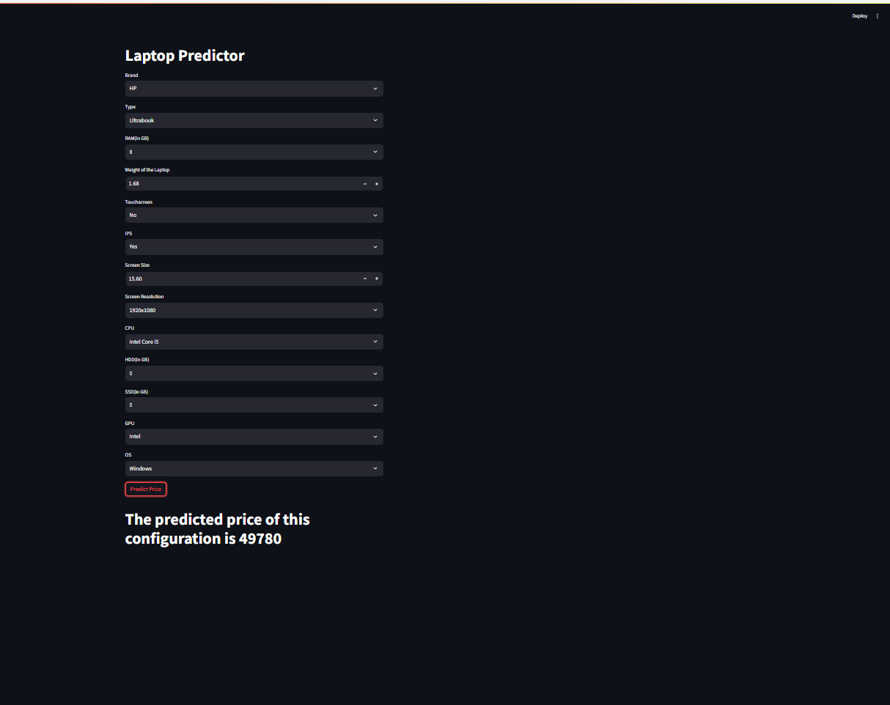
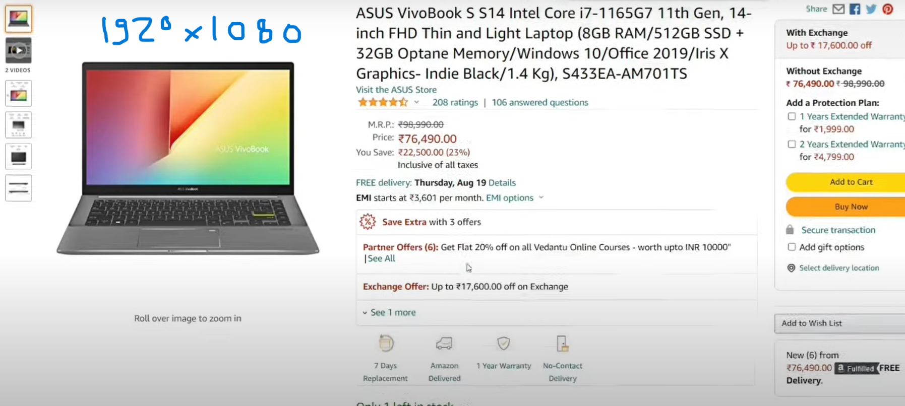
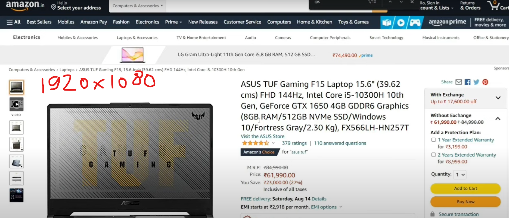

# Laptop Price Prediction

## Overview
This project aims to predict the price of laptops based on various features such as Company, TypeName, Ram, Weight, Touchscreen, Ips, ppi, Cpu brand, HDD, SSD, Gpu brand, and operating system (OS). The prediction model has been implemented as a web application using Streamlit, allowing users to interactively input laptop specifications and receive a predicted price.

## Problem Statement
The price of laptops varies significantly based on their specifications and features. As a result, consumers often find it challenging to determine a fair price for a laptop based on its characteristics. This project addresses this issue by developing a machine learning model capable of accurately predicting laptop prices. By leveraging machine learning techniques, we aim to provide consumers with a reliable tool for estimating laptop prices, helping them make informed purchasing decisions.

## Features
The following features are considered in the laptop price prediction model:
- Company: The brand of the laptop manufacturer.
- TypeName: The type or category of the laptop (e.g., gaming, ultrabook, workstation).
- Ram: Random Access Memory (RAM) capacity in gigabytes (GB).
- Weight: Weight of the laptop in kilograms (kg).
- Touchscreen: Whether the laptop has a touchscreen (Yes/No).
- Ips: Whether the laptop has an In-Plane Switching (IPS) display (Yes/No).
- ppi: Pixels Per Inch (PPI) of the laptop display.
- Cpu brand: Brand of the laptop's central processing unit (CPU).
- HDD: Hard Disk Drive (HDD) capacity in gigabytes (GB).
- SSD: Solid State Drive (SSD) capacity in gigabytes (GB).
- Gpu brand: Brand of the laptop's graphics processing unit (GPU).
- OS: Operating system installed on the laptop.

## Implementation
The project's implementation includes the following steps:
1. Data Collection: Obtain laptop dataset containing relevant features and prices.
2. Data Preprocessing: Clean and preprocess the dataset, handle missing values, encode categorical variables, and scale numerical features.
3. Model Selection: Experiment with multiple machine learning models, including linear regression, decision trees, random forests, and gradient boosting, to determine the best-performing model.
4. Model Evaluation: Evaluate each model using appropriate performance metrics such as Mean Absolute Error (MAE) and Root Mean Squared Error (RMSE).
5. Web Application Development: Use Streamlit to create a user-friendly web application for laptop price prediction.
6. Deployment: Deploy the web application to a suitable hosting platform for public access.

## Model Selection
Several machine learning models were considered and evaluated for this project, including:
- Linear Regression
- Ridge Regression
- Lasso Regression
- Knn
- SVM
- Extra Trees
- AdaBoost
- Gradient Boost
- XgBoost
- Voting Regressor
- Stacking
- Decision Trees
- Random Forests
- Gradient Boosting

After thorough experimentation and evaluation, the [Random Forest] model was selected as the most accurate and reliable for predicting laptop prices.

## Usage
To use the web application:
1. Install the required dependencies: `pip install -r requirements.txt`
2. Run the Streamlit app: `streamlit run app.py`
3. Access the web application via the provided URL and input the desired laptop specifications to obtain the predicted price.

## Contact Information
- **Name**: Sahil Tiwari
- **Email**: sahiltiwari1222@gmail.com
- **Phone**: 8670558757
- **Address**: Jogni Nagar,Rampur Jabalpur,India

# Try it Yourself
## Example Laptop Images
Example 1

*Predict Price of Example Laptop 1*

Result of Example 1 

Example 2

*Predict Price of Example Laptop 2*

Result of Example 2

### Social Media
- [LinkedIn](https://www.linkedin.com/in/sahil-tiwari-b2269b27a/)
- [GitHub](https://github.com/sahilTiwariiii)
- [Twitter](https://x.com/sahil_tiwa96610)
